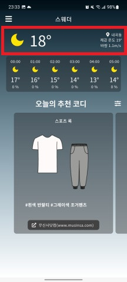
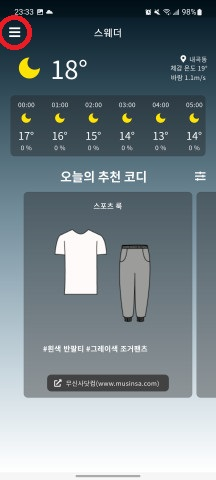

## 기온 정보 보기 기능

  
상단의 날씨 영역에선 코디에 참고할 수 있도록 현재 날씨, 기온 정보 및 체감온도, 바람 정보를 제공합니다.

## 예보 정보 보기 기능

  
날씨 예보 영역에서 미래 시간를 클릭해 특정 시간대에 추천되는 코디를 변경할 수 있습니다.
외출 후 저녁에 쌀쌀해질 때를 대비해 코디를 하는 등에 활용할 수 있습니다. 날씨 예보는 24시간만큼 제공합니다.

## 추천 코디 보기 기능

하단의 추천 코디 영역에선 날씨/기온 정보를 반영해 코디를 추천해줍니다. 현재 날씨를 기준으로 코디를 추천하며, 20개의 코디를 보여줍니다. 원하는 코디가 없다면 맨 끝의 더 불러오기 버튼을 통해 20개씩 코디를 추가적으로 불러올 수 있습니다.

하단의 코디 링크를 통해 일러스트가 아닌 실물 코디맵 사진을 확인할 수 있습니다.

## 필터 기능

입고 싶은 의상이 포함된 코디만 보고 싶다면 필터 기능을 통해 특정 의상이 포함된 코디만 나오도록 설정할 수 있습니다. 예를 들어 "셔츠"가 입고싶다면 셔츠를 필터에 적용하면 셔츠가 포함된 코디만 추천됩니다.

필터링 가능한 의상은 기온에 맞춰 의상을 추천 가능한 옷들만 보입니다. 예를 들어 여름엔 코트나 패딩등의 의상이 필터 리스트에 나타나지 않습니다.

필터링은 다른 종류의 옷끼리는 OR 연산이, 같은 종류의 옷끼리는 AND 연산이 적용됩니다. 예를 들어, 아우터에 "가디건", 상의에 "반팔티, 반팔 셔츠"를 선택하면 가디건과 (반팔티 또는 반팔 셔츠) 가 포함된 코디가 추천됩니다.

## 유저 설정

## 위치 관리

위치 관리 화면에선 위치를 추가,삭제할 수 있습니다. 또한 위치를 선택해 특정 지역에 맞춘 코디가 추천되도록 할 수 있습니다.

## 성별 관리

성별 관리 화면에서 성별을 설정해줄 수 있습니다. 설정된 성별에 따라 다르게 코디가 추천됩니다. 예를 들어 "여자"로 성별을 설정하면 스커트, 원피스 등의 코디가 함께 추천되고 "남성"의 경우 추천되지 않습니다.

## 체질 관리

추천되는 코디가 조금 춥거나 덥다면 체질 관리 화면에서 추천되는 코디를 더 시원하게 설정할 수 있습니다.
